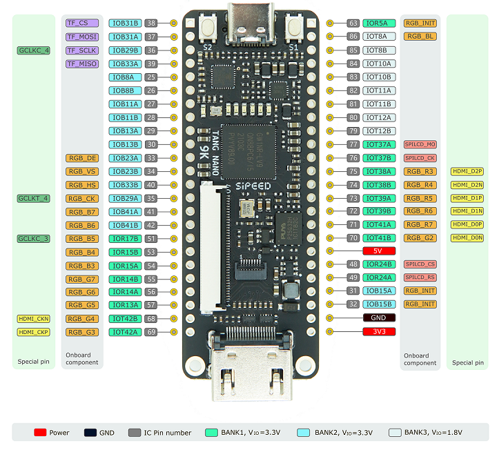
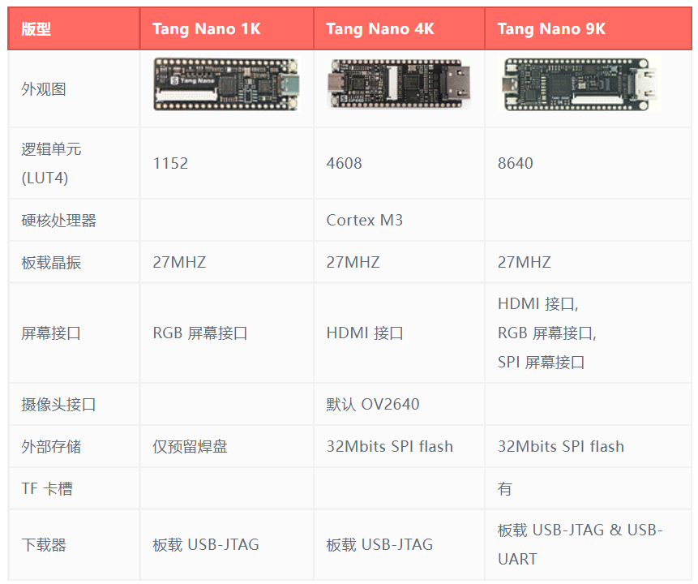

[wiki][https://wiki.sipeed.com/hardware/zh/tang/Tang-Nano-9K/Nano-9K.html]，[doc][http://tangnano.sipeed.com/zh/]

#### PinMap



#### Peripheral


#### Contrast



#### Fireware

默认固件：上电后，会有 1 次流水灯，随后串口（baud：115200）会打印 `Logo` 和 `指令表`，并按 S1 可复位芯片。

```
  ____  _          ____         ____
 |  _ \(_) ___ ___/ ___|  ___  / ___|
 | |_) | |/ __/ _ \___ \ / _ \| |
 |  __/| | (_| (_) |__) | (_) | |___
 |_|   |_|\___\___/____/ \___/ \____|

        On Lichee Tang Nano-9K


Select an action:

   [1] Toggle led 1
   [2] Toggle led 2
   [3] Toggle led 3
   [4] Toggle led 4
   [5] Toggle led 5
   [6] Toggle led 6
   [F] Get flash mode
   [I] Read SPI flash ID
   [S] Set Single SPI mode
   [D] Set DSPI mode
   [C] Set DSPI+CRM mode
   [B] Run simplistic benchmark
   [A] Benchmark all configs

IO State: 0000007f

Command> 
```

#### Files

- 规格书：Specification
- 器件位号：Designator Drawing
- 尺寸图：Dimensional Drawing