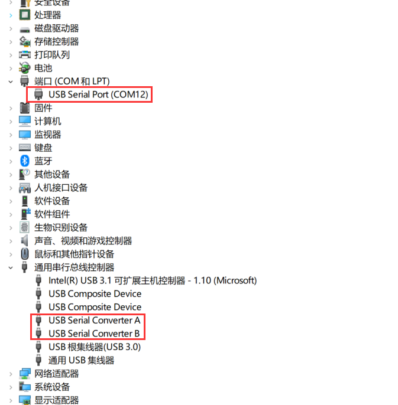
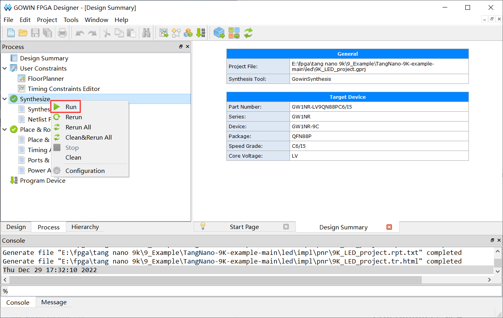
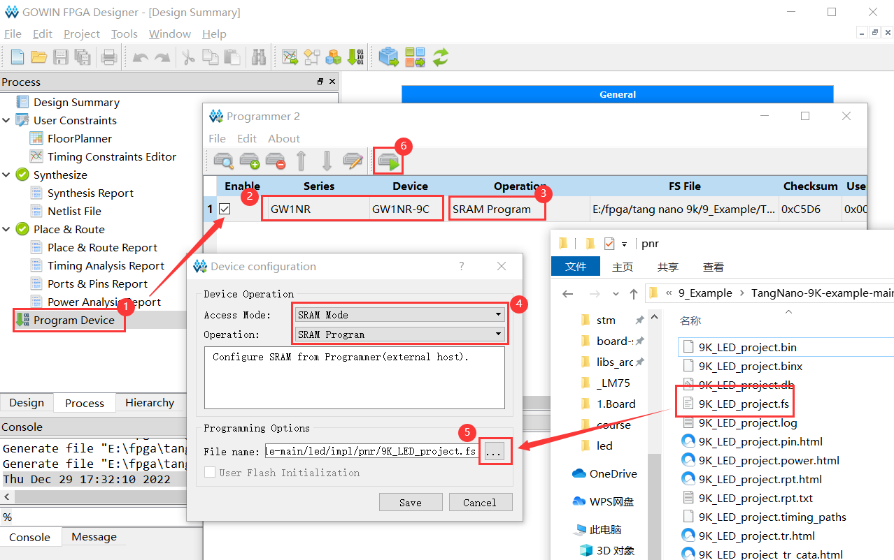
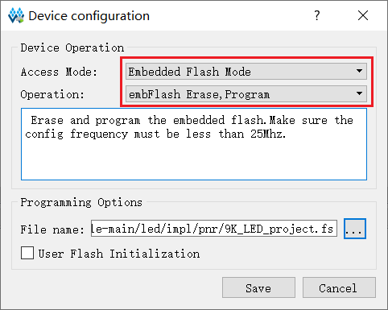
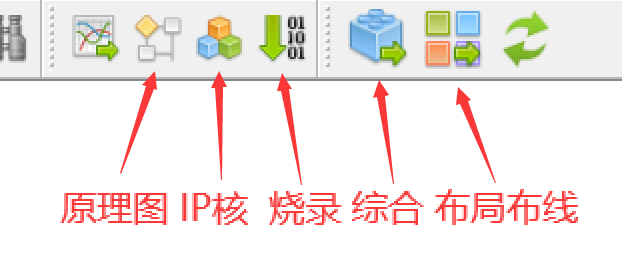
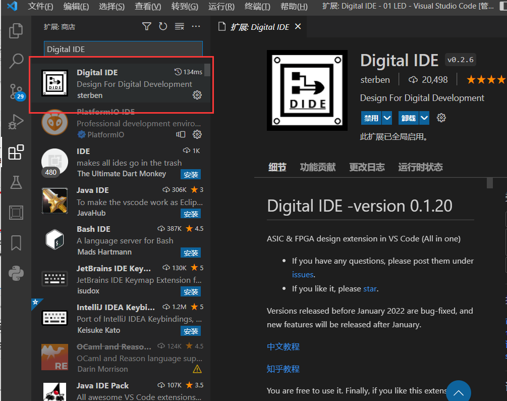

#### Install：安装

下载[教育版][http://www.gowinsemi.com.cn/faq.aspx]（不需要 `license` ），默认安装。

（我的版本： `Gowin_V1.9.8.07_Education_win.exe` ）

把 Programmer 解压并替换掉 Gowin 原先的 Programmer 即可。

----

插上板子后会出现如下设备：

---

#### Compile：综合

双击 / 右键运行。

#### Place & Route：布线

双击 / 右键运行。

#### Programmer：烧录

选择芯片型号 `GW1NR-9C`，选择 `SRAM Mode` (主用于调试，掉电丢失) / `embedded flash mode` (掉电不丢失) ，选择位于 `\impl\pnr` 中的 `.fs` 文件，烧录即可。 

#### ToolBar：工具栏

#### Coding：编辑

VSCode + Dogital IDE：主用于编写代码（关键字提示 & 代码格式化）

#### 

