#### 新建工程

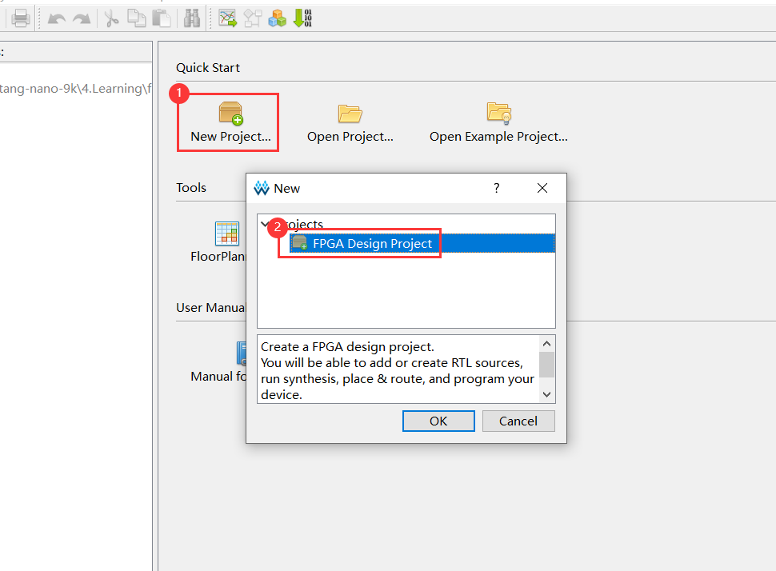

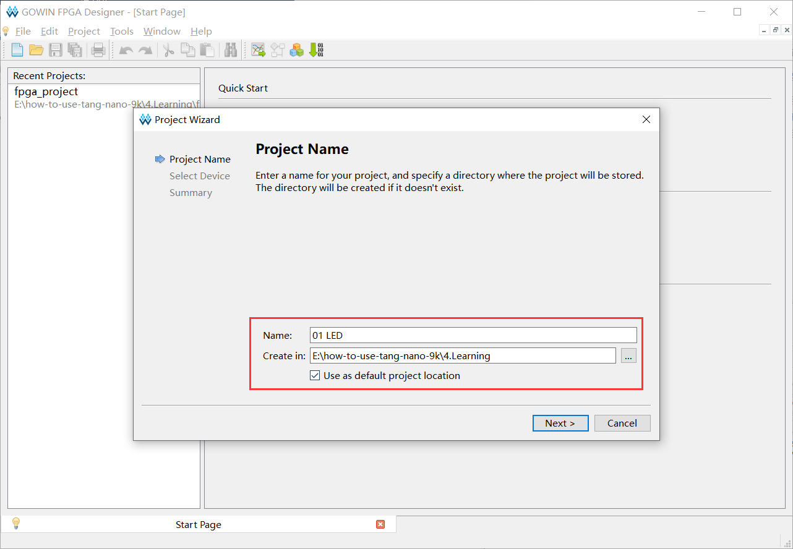

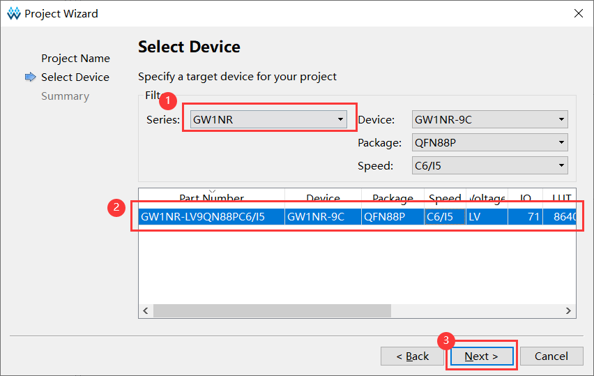

#### 添加模块

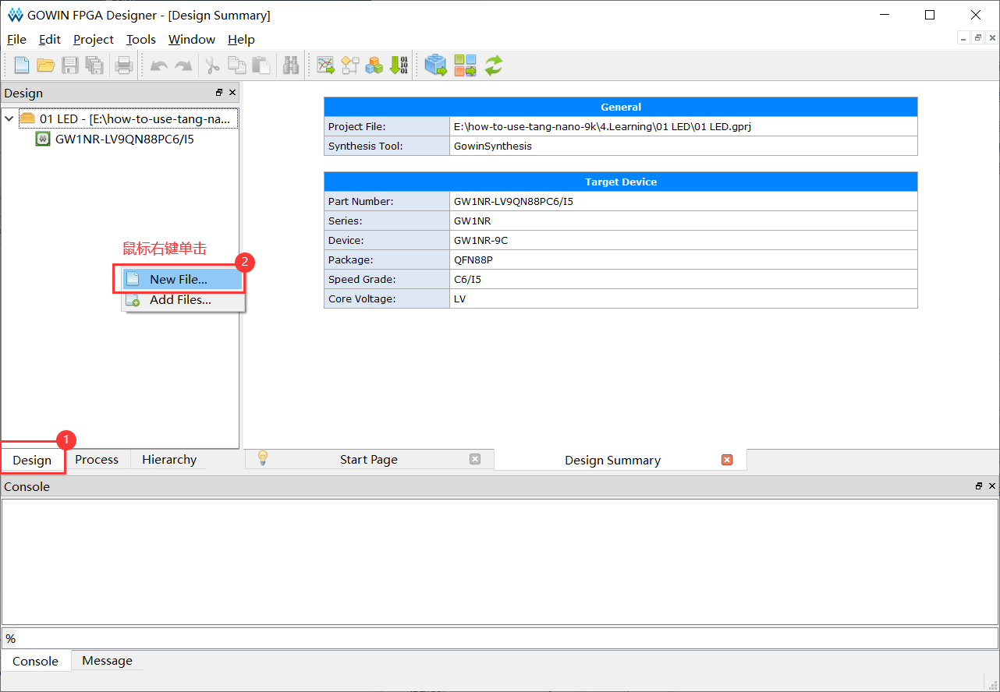

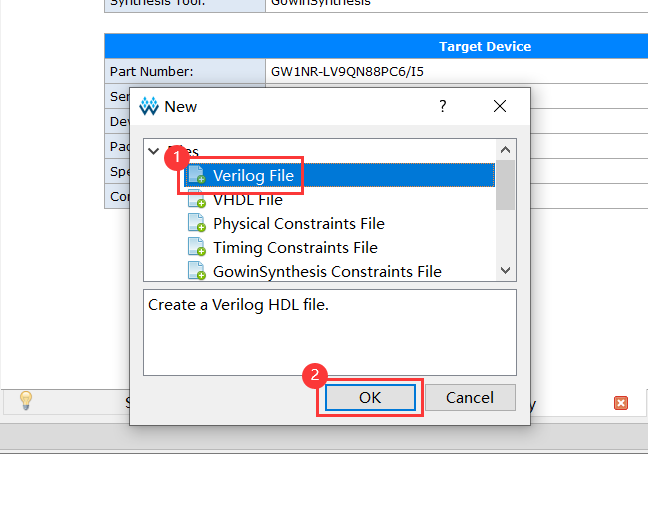

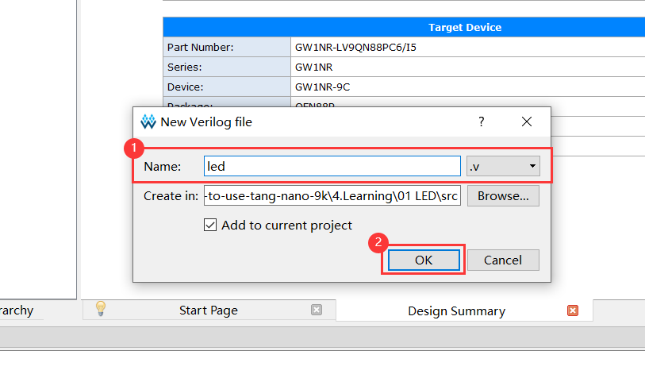

##### 例程

板载晶振 27MHz，在没有倍频的情况下，从 0 计数到 13499999 需要 0.5s。

```verilog
// Crystal oscillator frequency is 27MHz, so it takes 0.5s to count from 0 to 13499999 (13.5MHz)
`define target 24'd1349_9999

module led(
        input clk_in, // sys clk
        input btn_rst,
        output reg [5:0] led
    );

    /* 24 bit counter */
    reg [23:0] counter;

    /* clock rising edge or button falling edge */
    always @(posedge clk_in or negedge btn_rst)
    begin
        /* ① reset button is pressed
         * ② counter reaches target value */
        if((!btn_rst) || (counter == `target))
            counter <= 24'd0; // reset counter
        /* counter less than target value */
        else
            counter <= counter + 1'd1; // increase 1
    end

    /* clock rising edge or button falling edge */
    always @(posedge clk_in or negedge btn_rst)
    begin
        /* reset button is pressed */
        if(!btn_rst)
            led <= 6'b111110;
        /* counter reaches target value */
        else if (counter == `target)
            led[5:0] <= {led[4:0],led[5]}; // 循环左移
    end

endmodule
```

##### 关键字

| Verilog   | C       | Desc         |
| --------- | ------- | ------------ |
| `define   | #define | 宏定义       |
| module    |         | 模块头       |
| endmodule |         | 模块尾       |
| input     |         | 输入引脚     |
| output    |         | 输出引脚     |
| reg [n:0] |         | 变量定义     |
| always    |         | 等待条件成立 |
| posedge   |         | 上升沿       |
| negedge   |         | 下降沿       |
| begin     | {       | 代码块头     |
| end       | }       | 代码块尾     |
| <=        | =       | 变量赋值     |

`if` / `else if` / `else` ：

- C：单行代码时可不加 `{` 和 `}`，多行代码时需添加。
- verilog ：单行代码时可不加 `begin` 和 `end`，多行代码时需添加。

 `++` / `--`：

* C：含有自增减运算符
* verilog：不含自增减运算符

##### 数字

位宽 + 单引号 + 进制 + 数字

`24'd1349_9999`：24 位，十进制

`6'b111110`：6 位，二进制

##### 编译代码

Synthesize：综合代码，检查语法

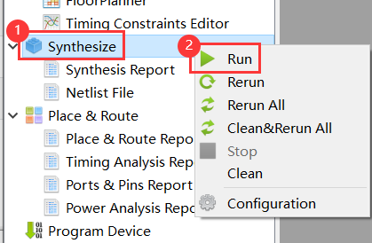

run：编译指定部分

rerun：重新编译指定部分

rerun all：重新编译整个工程

clean & rerun all：清除后重新编译整个工程

#### 配置引脚

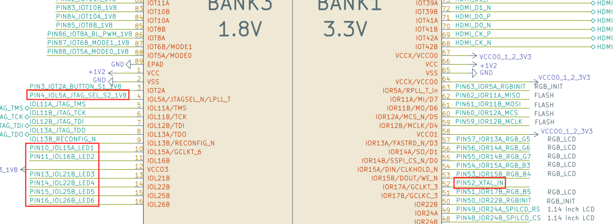

硬件标号：

| Pin     | Num  |
| ------- | ---- |
| LED1    | 10   |
| LED2    | 11   |
| LED3    | 13   |
| LED4    | 14   |
| LED5    | 15   |
| LED6    | 16   |
| BTN_RST | 4    |
| CLK_IN  | 52   |

**FloorPlanner**

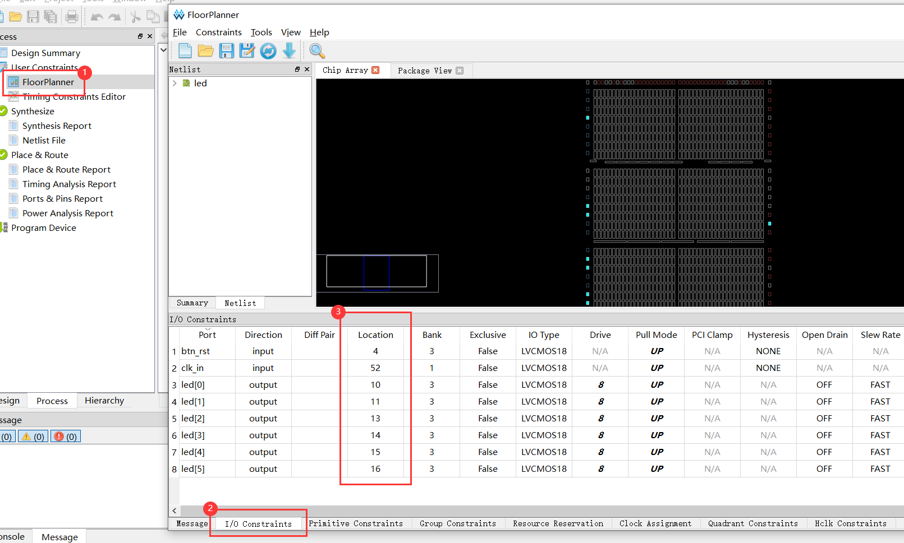

##### 连接至外设

Place & Route：将代码中的接口路由到硬件上的实际外设。

双击编译：

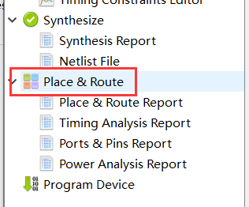

##### 查看原理图

##### 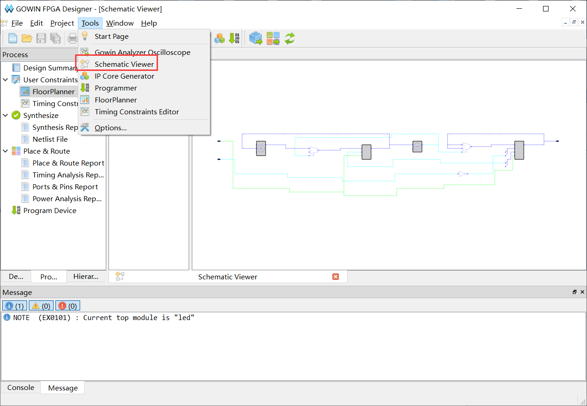