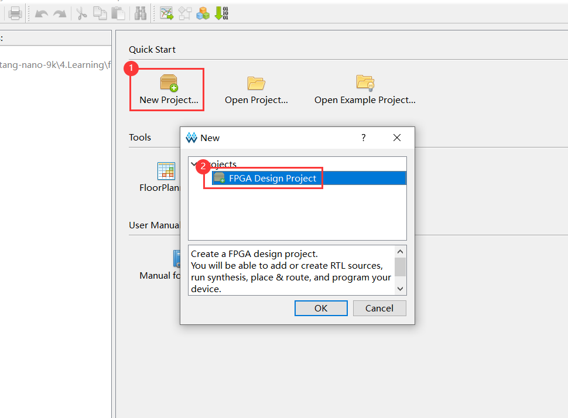
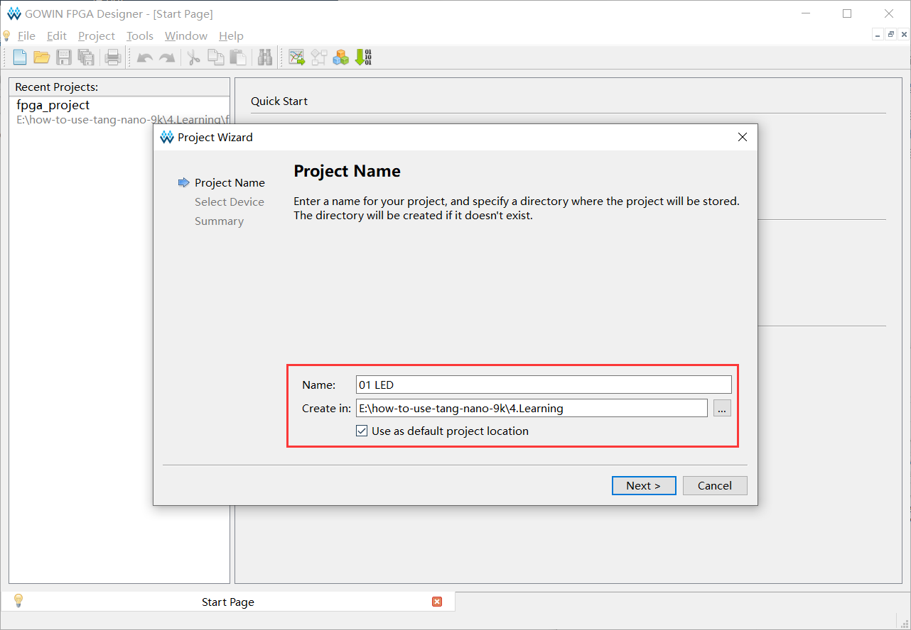
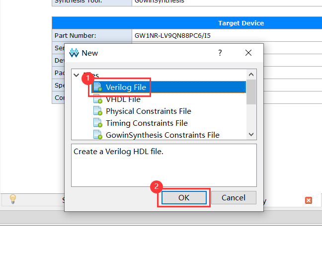
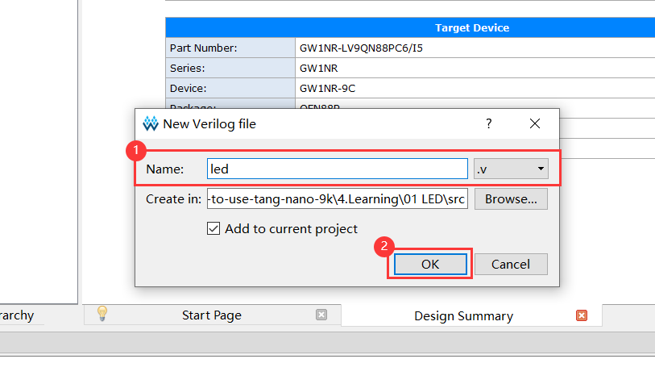
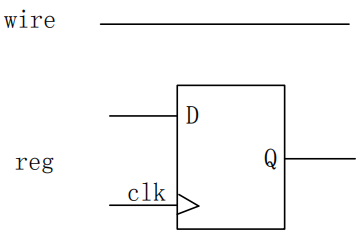
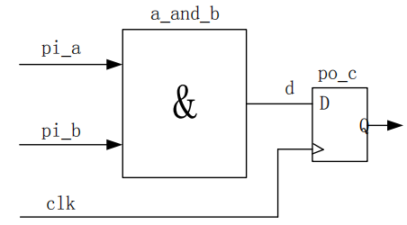
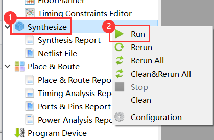
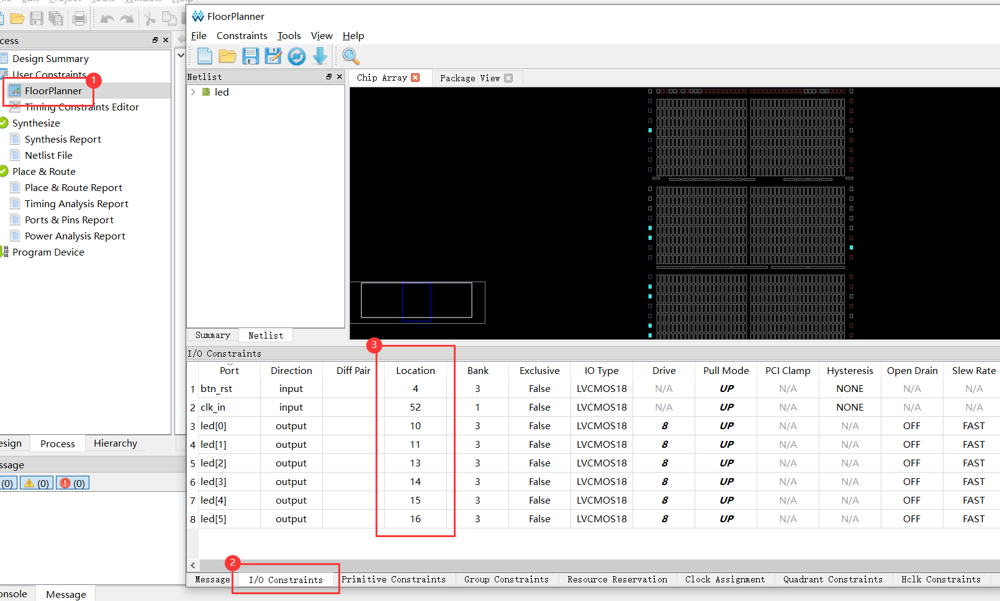
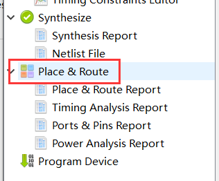

## 新建工程






## 添加模块






### 例程

板载晶振 27MHz，在没有倍频和分频的情况下，从 0 计数到 13499999 需要 0.5s。

实现功能：流水灯闪灯间隔 0.5s。

```verilog
// Crystal oscillator frequency is 27MHz, so it takes 0.5s to count from 0 to 13499999 (13.5MHz)
`define target 24'd1349_9999

module led(
        input clk_in, // sys clk
        input btn_rst,
        output reg [5:0] led
    );

    /* 24 bit counter */
    reg [23:0] counter;

    /* clock rising edge or button falling edge */
    always @(posedge clk_in or negedge btn_rst)
    begin
        /* ① reset button is pressed
         * ② counter reaches target value */
        if((!btn_rst) || (counter == `target))
            counter <= 24'd0; // reset counter
        /* counter less than target value */
        else
            counter <= counter + 1'd1; // increase 1
    end

    /* clock rising edge or button falling edge */
    always @(posedge clk_in or negedge btn_rst)
    begin
        /* reset button is pressed */
        if(!btn_rst)
            led <= 6'b111110;
        /* counter reaches target value */
        else if (counter == `target)
            led[5:0] <= {led[4:0],led[5]}; // 循环左移
    end

endmodule
```

### 语法

| Verilog     | C       | Desc            |
| ----------- | ------- | --------------- |
| `define     | #define | 宏定义          |
| module      |         | 模块头          |
| endmodule   |         | 模块尾          |
| input       |         | 输入引脚        |
| output      |         | 输出引脚        |
| reg [n-1:0] |         | 变量定义(n bit) |
| always      |         | 触发条件        |
| posedge     |         | 上升沿          |
| negedge     |         | 下降沿          |
| begin       | {       | 代码块头        |
| end         | }       | 代码块尾        |
| =           | =       | 阻塞赋值        |
| <=          |         | 非阻塞赋值      |

`if` / `else if` / `else` ：

- C：单行代码时可不加 `{` 和 `}`，多行代码时需添加。
- verilog ：单行代码时可不加 `begin` 和 `end`，多行代码时需添加。

 `++` / `--`：

* C：含有自增减运算符
* verilog：不含自增减运算符

#### 变量

##### 类型

数字电路中信号只有两种状态：传输（wire，线型）和储存（reg，寄存器型）。

- wire 在物理结构上就是根线，可理解为杜邦线。（在 assign 中赋值）
- reg 在存储数据时需要在 clk 时钟信号下完成。（在 always 中赋值）



##### 定义

不带位宽：位宽为 1

```verilog
wire v; // 1 bit
reg v; // 1 bit
```

带位宽：[m,n] 位宽为 |m-n|+1

```verilog
wire [7:0] v; // 8 bit
wire [0:7] v; // 8 bit
wire [8:1] v; // 8 bit, 可以但不建议
reg [7:0]v; // 8 bit
```

#### 赋值

**阻塞赋值** `=`：用于组合逻辑

```
po_c = pi_a & pi_b
```


**非阻塞赋值** `<=`：用于时序逻辑

```verilog
p0_c <= pi_a & pi_b
```



---

组合逻辑 c1：ab 变，c 就变

时序逻辑 c2：c 在 clk 的上升沿时才会变


#### 常数

位宽 + 单引号 + 进制 + 数字

|         | 位宽 | 进制 | 等价于   |
| ------- | ---- | ---- | -------- |
| 4’h1010 | 4    | 16   |          |
| 4’d1010 | 4    | 10   |          |
| 4’b1010 | 4    | 2    |          |
| ’b1010  | 32   | 2    |          |
| 3’b1010 | 3    | 2    | 3’b010   |
| 1010    | 32   | 10   | 32’d1010 |

当某常数用得较频繁，可使用关键字 `parameter` 来定义：

```
parameter NUM = 3;
```

注：Verilog 是大小写敏感的。

### 综合

Synthesize：综合代码，检查语法



run：编译指定部分

rerun：重新编译指定部分

rerun all：重新编译整个工程

clean & rerun all：清除后重新编译整个工程

## 配置引脚


硬件标号：

| Pin     | Num  |
| ------- | ---- |
| LED1    | 10   |
| LED2    | 11   |
| LED3    | 13   |
| LED4    | 14   |
| LED5    | 15   |
| LED6    | 16   |
| BTN_RST | 4    |
| CLK_IN  | 52   |

**FloorPlanner**



### 布线

Place & Route：将代码中的接口路由到硬件上的实际外设。

双击编译：



## 原理图

##### 