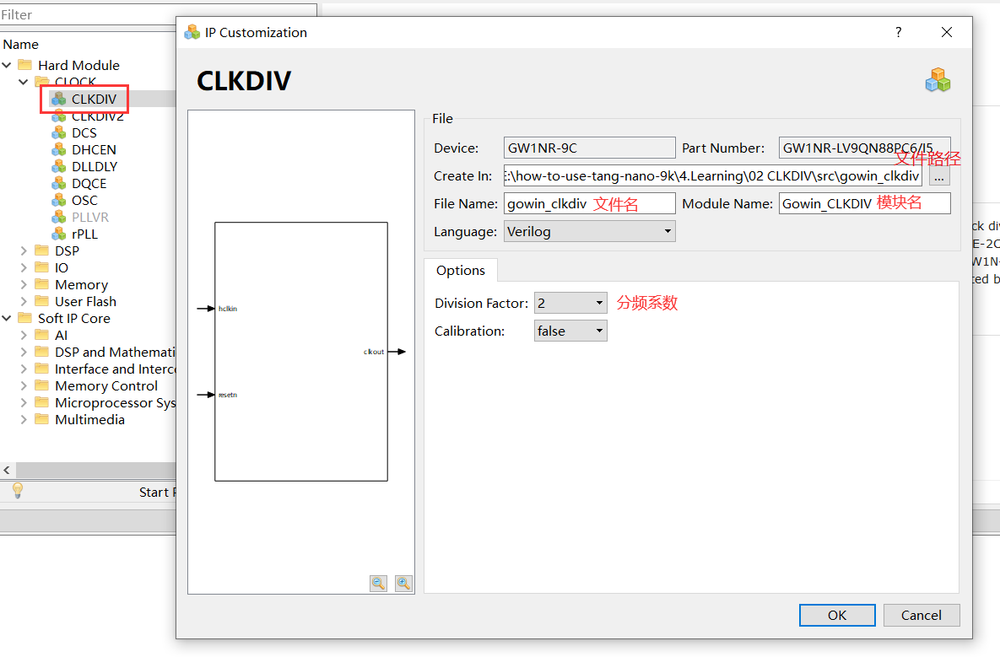
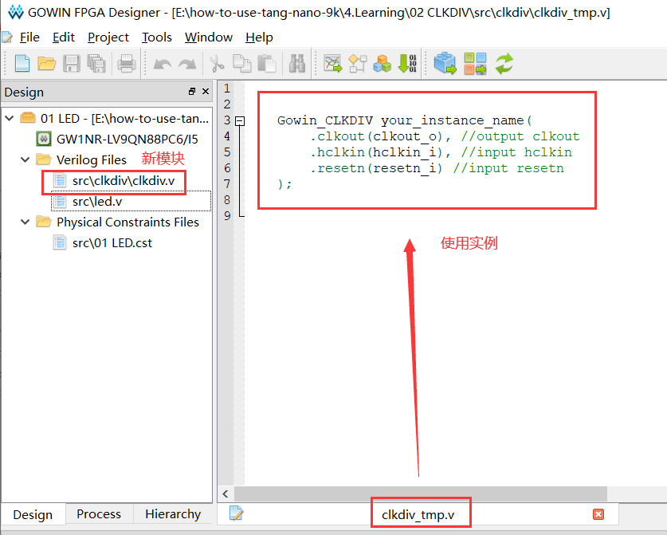
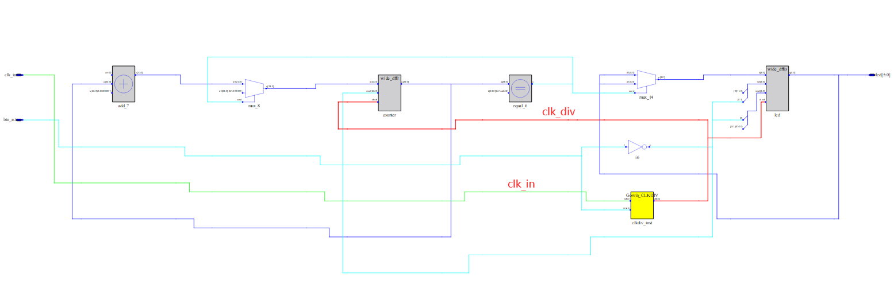

### IP 核

#### 时钟分频



此处我把把保存路径核文件名改为 `clkdiv`，点击 OK 按钮生成文件。



将该实例复制到 led.v 中，并进行如下修改：

```verilog
wire clk_div;

Gowin_CLKDIV clkdiv_inst(
    .clkout(clk_div), // clk_out
    .hclkin(clk_in), // clk_in
    .resetn(btn_rst)
);

always @(posedge clk_div or negedge btn_rst)
```

### 例程

板载晶振 27MHz，在2分频的情况下，从 0 计数到 13499999 需要 1s。

实现功能：流水灯闪灯间隔 1s 。

代码里使用了条件编译，通过宏来引入相应代码段。

`led.v`

```verilog
/* Crystal oscillator frequency is 27MHz, clock division coefficient is 2
 * so it takes 1s to count from 0 to 13499999 ( 13.5MHz / 2 = 6.75MHz ) */

`define USE_MODULE_CLKDIV

module led(
        input clk_in, // sys clk
        input btn_rst,
        output reg [5:0] led
    );

    /* clock divider */

    wire clk_div;

`ifdef USE_MODULE_CLKDIV

    // use clkdiv module

    Gowin_CLKDIV clkdiv_inst(
                     .clkout(clk_div), // clk_out
                     .hclkin(clk_in), // clk_in
                     .resetn(btn_rst)
                 );

`else
    
    // copy from clkdiv module

    wire gw_gnd;

    assign gw_gnd = 1'b0;

    CLKDIV clkdiv_inst (
               .CLKOUT(clk_div), // clk_out
               .HCLKIN(clk_in), // clk_in
               .RESETN(btn_rst),
               .CALIB(gw_gnd)
           );

    defparam clkdiv_inst.DIV_MODE = "2"; // 分频系数
    defparam clkdiv_inst.GSREN = "false"; // 全局复位GSR

`endif

    /* 24 bit counter */
    reg [23:0] counter;

    /* target value for counter */
    parameter  target = 24'd1349_9999;

    /* clock rising edge or button falling edge */
    always @(posedge clk_div or negedge btn_rst)
    begin
        /* ① reset button is pressed
         * ② counter reaches target value */
        if((!btn_rst) || (counter == target))
            counter <= 24'd0; // reset counter
        /* counter less than target value */
        else
            counter <= counter + 1'd1; // increase 1
    end

    /* clock rising edge or button falling edge */
    always @(posedge clk_div or negedge btn_rst)
    begin
        /* reset button is pressed */
        if(!btn_rst)
            led <= 6'b111110;
        /* counter reaches target value */
        else if (counter == target)
            led[5:0] <= {led[4:0],led[5]}; // 循环左移
    end

endmodule
```

`clkdiv.v`

```verilog
`ifdef USE_MODULE_CLKDIV

module Gowin_CLKDIV (clkout, hclkin, resetn);

    output clkout;
    input hclkin;
    input resetn;

    wire gw_gnd;

    assign gw_gnd = 1'b0;

    CLKDIV clkdiv_inst (
               .CLKOUT(clkout),
               .HCLKIN(hclkin),
               .RESETN(resetn),
               .CALIB(gw_gnd)
           );

    defparam clkdiv_inst.DIV_MODE = "2";
    defparam clkdiv_inst.GSREN = "false";

endmodule

`endif
```

### 原理图

可以看到 clk_in 经过分屏输出 clk_div 接到寄存器上。




