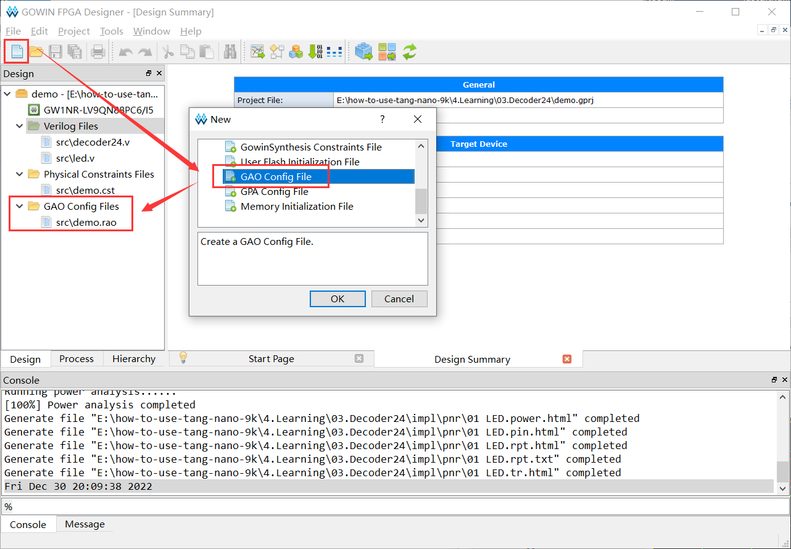
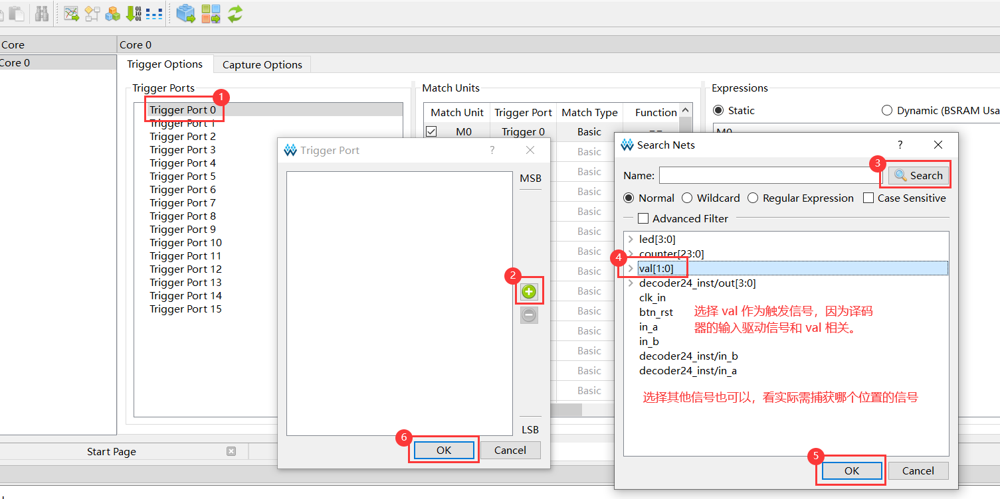
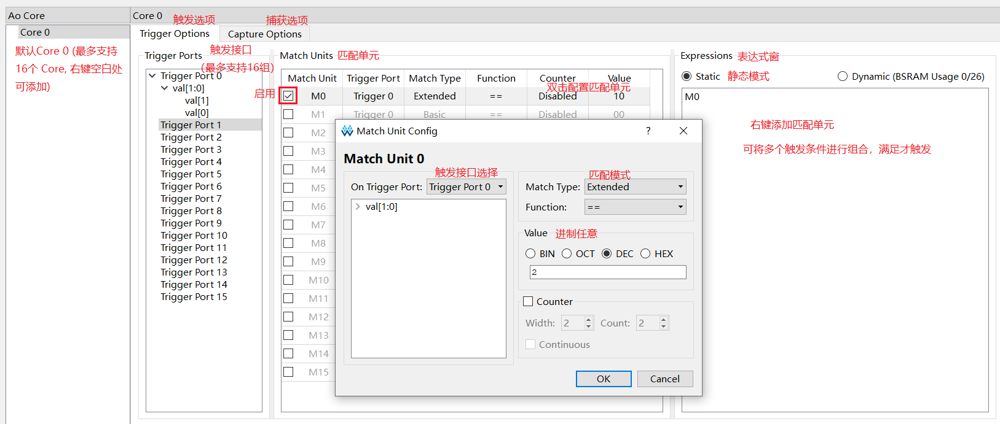
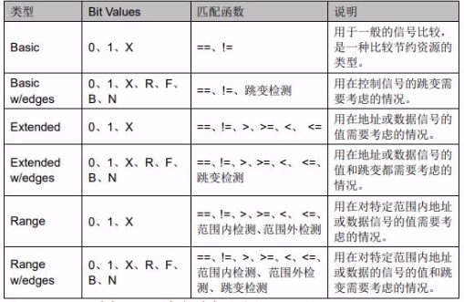
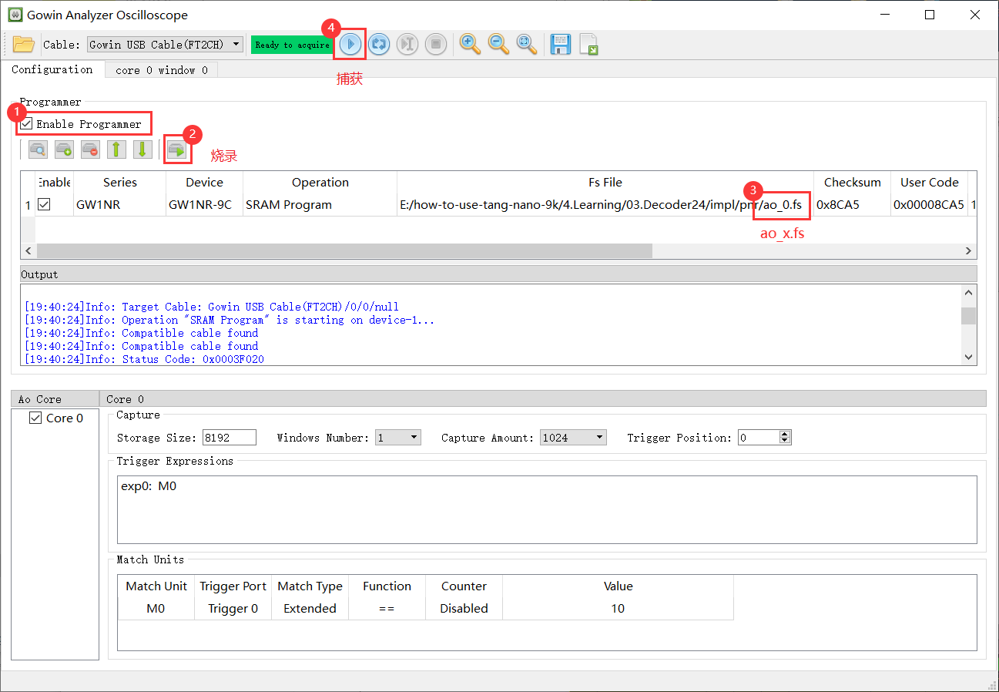
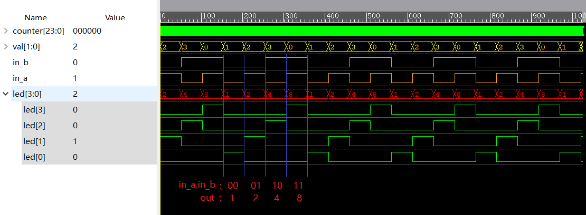

### 24译码器

`led.v`

```verilog
/* Crystal oscillator frequency is 27MHz, so it takes 1s to count from 0 to 13499999 ( 13.5MHz ) */

`define USE_ANALYZER

module led(
        input clk_in, // sys clk
        input btn_rst,
        output wire [3:0] led
    );

    /* 24 bit counter */
    reg [23:0] counter;

    /* target value for counter */

`ifdef USE_ANALYZER

    // 使用逻辑分析仪时：

    // 设定低目标值，方便观察波形
    parameter  target = 24'd50;

`else

    // 不使用逻辑分析仪时：

    /* 因为板载LED是低电平点亮，
    * 设置译码器输出的状态取反，
    * 即每次只输出1个低电平 */
`define DECODER_MODE_NOT

    // 设定高目标值，方便观察闪灯
    parameter  target = 24'd13499999;

`endif

    /* 2-4 decoder */

    reg [1:0] val;

    reg in_a,in_b;

    decoder24 decoder24_inst(
                  .in_b(in_b), // msb
                  .in_a(in_a), // lsb
                  .out(led)
              );

    /* clock rising edge or button falling edge */
    always @(posedge clk_in or negedge btn_rst)
    begin
        /* reset button is pressed */
        if(!btn_rst)
        begin
            counter <= 24'd0; // reset counter
            val <= 1'b0;
        end
        /* counter reaches target value */
        else if(counter == target)
        begin
            counter <= 24'd0; // reset counter

            val <= val + 1'd1;  // increase 1

            case(val)
                2'b00:
                begin
                    in_b <= 1'b0;
                    in_a <= 1'b0;
                end
                2'b01:
                begin
                    in_b <= 1'b0;
                    in_a <= 1'b1;
                end
                2'b10:
                begin
                    in_b <= 1'b1;
                    in_a <= 1'b0;
                end
                2'b11:
                begin
                    in_b <= 1'b1;
                    in_a <= 1'b1;
                end
            endcase

        end
        /* counter less than target value */
        else
        begin
            counter <= counter + 1'd1; // increase 1
        end

    end

endmodule
```

`decoder24.v`

```verilog
//`define DECODER_MODE_NOT

module decoder24 (
        input in_b,in_a,
        output reg [3:0] out
    );

    always @(in_b,in_a) begin

    case ({in_b,in_a})
`ifndef DECODER_MODE_NOT
        2'b00: out = 4'b0001;
        2'b01: out = 4'b0010;
        2'b10: out = 4'b0100;
        2'b11: out = 4'b1000;
`else 
        2'b00: out = 4'b1110;
        2'b01: out = 4'b1101;
        2'b10: out = 4'b1011;
        2'b11: out = 4'b0111;
`endif
    endcase

    end

endmodule
```

### 逻辑分析仪

#### 添加分析仪



双击 `*.rao`，进行参数配置。

#### 触发配置





触发模式：



| Bit  | Desc          |
| ---- | ------------- |
| 0    | 低电平        |
| 1    | 高电平        |
| x    | 低电平/高电平 |
| R    | 上升沿        |
| F    | 下降沿        |
| B    | 上升沿/下降沿 |

#### 捕获配置


#### 重新烧录

重在新综合和布局布线，打开逻辑分析仪，烧录文件 `ao_x.fs` 。




#### 捕获结果

