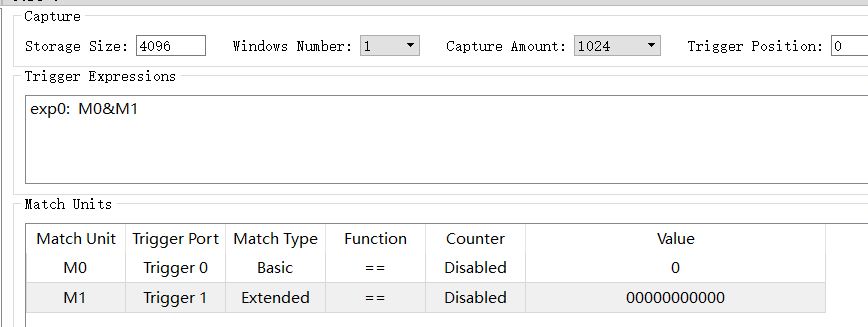

##### 块内存

SP：single port，单端口模式，即半双工模式。


##### 逻辑分析仪

##### 


**①**

```verilog
`define USE_LOGIC_ANALYZER
```


因为用的是与条件，所以上图开始捕获信号的条件是 M0=1 (写模式), M1=20 (地址等于20)。


**②**

```verilog
`define READ_ONLY
`define USE_LOGIC_ANALYZER
defparam sp_inst_0.INIT_RAM_00 = 256'hFEDCBA9876543210FEDCBA9876543210FEDCBA9876543210FEDCBA9876543210; 
```



因为用的是与条件，所以上图开始捕获信号的条件是 M0=1 (读模式), M1=20 (地址等于0)。


